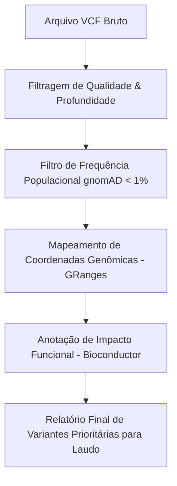

# Pipeline de Anotação e Interpretação Clínica de Variantes Genéticas (NGS)

## 👩‍🔬 Autoria e Perfil Estratégico

**Cristiane Signorelli Rebolla**

Analista de Sistemas com sólida experiência em mapeamento de processos empresariais e arquitetura de dados (ERPs TOTVS), atualmente graduanda em **Biomedicina**.

Estou unindo minha bagagem de anos na tecnologia da informação com a paixão pela saúde molecular. Minha entrada na **Bioinformática** é o pilar central da minha transição de carreira, onde aplico lógica de sistemas, manipulação de bancos de dados e automação de processos computacionais para otimizar a análise de dados genômicos e acelerar o diagnóstico de precisão.

📫 *Contato:*
*   *LinkedIn:* https://www.linkedin.com/in/cristiane-rebolla/
*   *E-mail:* cristiane013.sr@gmail.com

---

Este repositório contém um pipeline de bioinformática estruturado para a filtragem, anotação e priorização clínica de variantes genéticas provenientes de Sequenciamento de Nova Geração (NGS) em painéis de oncologia. 

O objetivo principal deste projeto é simular o fluxo de trabalho pós-sequenciador de um laboratório de diagnóstico molecular, transformando dados brutos de mutações em informações biologicamente interpretáveis e acionáveis para laudos clínicos.

---

## 🧬 Contexto Clínico & Objetivos
Em oncologia diagnóstica, painéis de NGS geram milhares de variantes por amostra. O grande gargalo analítico reside em separar variantes benignas e ruídos de sequenciamento daquelas mutações verdadeiramente patogênicas (drivers) que possuem relevância diagnóstica ou terapêutica. 

*Este pipeline soluciona esse impasse através de:*
*   *Controle de Qualidade Robusto:* Filtragem de variantes por profundidade de cobertura e score de qualidade de chamada (Qual).
*   *Frequência Populacional:* Exclusão de variantes comuns na população geral utilizando bancos de dados genômicos globais (como gnomAD), focando em mutações raras potencialmente patogênicas.
*   *Anotação de Impacto Biológico:* Identificação das consequências funcionais da variante no príon/proteína (mutações missense, nonsense, frameshift).
*   *Classificação Baseada em Diretrizes:* Triagem com foco nos critérios de patogenicidade da ACMG (American College of Medical Genetics and Genomics).

---

## 🛠️ Tecnologias e Ferramentas Utilizadas
*   *Ambiente Operacional:* Linux / Terminal Unix (WSL - Ubuntu) para manipulação ágil e isolada de grandes volumes de dados.
*   *Linguagem Principal:* R (v4.5) integrada em ambiente virtualizado via Miniconda.
*   *Ecossistema Principal:* *Bioconductor* (utilizando pacotes especializados para manipulação de coordenadas genômicas, ranges e anotações funcionais).
*   *Formatos de Arquivos Manipulados:* VCF (Variant Call Format) e anotações em formato GTF/GFF.

---

## 📈 Estrutura do Pipeline (Workflow)

---

## 📦 Entregáveis do Projeto
* *Dados Brutos (Input):* data/valid-4.0.vcf (Fragmento do projeto 1000 Genomas)
* *Scripts do Pipeline:* [Pasta /scripts com as 4 etapas documentadas](https://github.com/seu-usuario/pipeline-anotacao-variantes-clinicas/tree/main/scripts)
* *Relatório Final (Output):* [output/genes_alvo_laudo.txt](https://github.com/seu-usuario/pipeline-anotacao-variantes-clinicas/blob/main/output/genes_alvo_laudo.txt) -> Lista de IDs de genes purificados e prontos para integração com sistemas hospitalares ou LIS.
